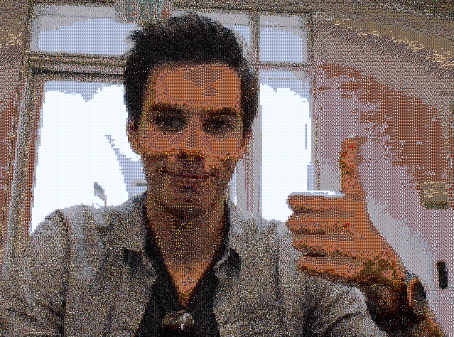
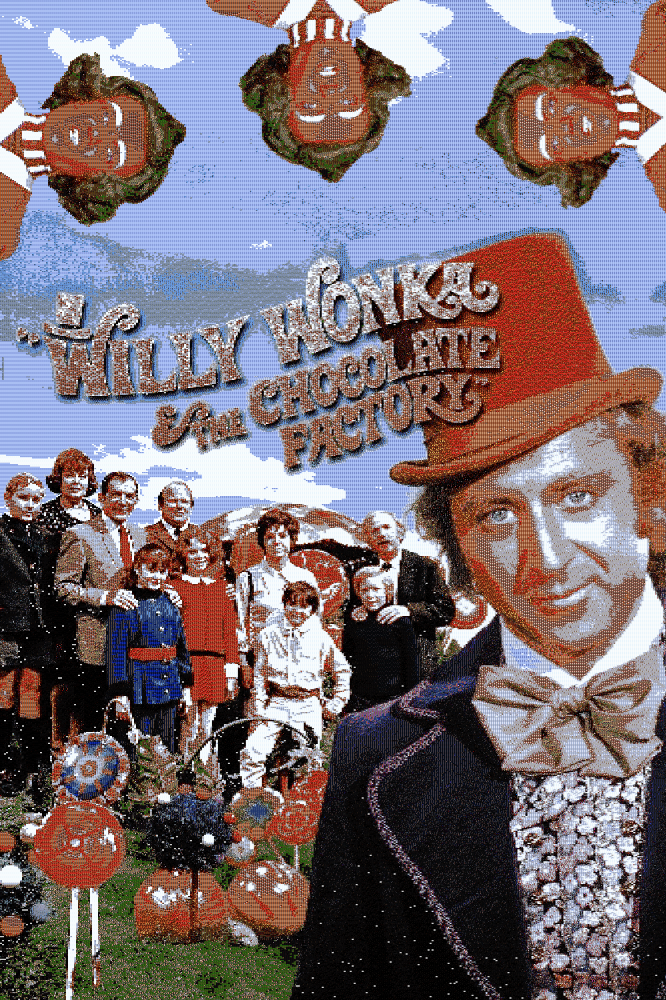

### Mosaic Reconstruction Lab

#### Given:
A 600mb folder containing 5,882 images representing the video frames from the 1971 movie Willy Wonka & the Chocolate Factory (1 frame was taken from each second of the movie).

#### Task:

Reconstruct a target image (or video input from the webcam) with a mosaic built using the provided images as mosaic pixels, and maintaining the correct color values for each sub region of the image. 

#### Approach:

I created a color-space bucket data structure that grouped images into size-constricted color-space buckets during the initial loading from file process. Color space comparison and thresholding was calculated using the euclidean distance between the average RGB value of each image (calculated just once during initial image loading). 

With this design, I was able to keep the image searching component of my mosaic construction code far below ***O(n)*** time (***n*** being the number of images), which enabled me to run it real-time on the webcam. The exact time complexity of each image search (one search is performed for each pixel of the mosaic) is ***O(B + E),*** where B is the number of buckets (typically about 3-5% of the size of `n`), and E is the maximum number of elements in a bucket, which is determined by the `max_bucket_size` variable. 

### Webcam demo:

  

  

### Willie Wonka poster, in all its glory:

